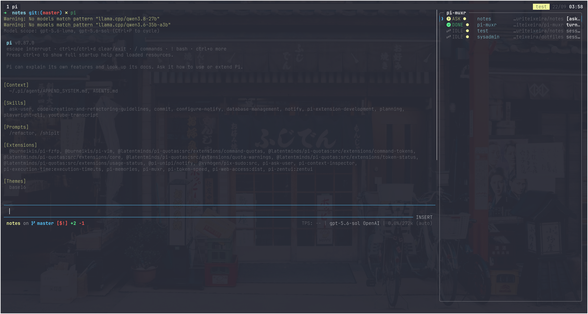
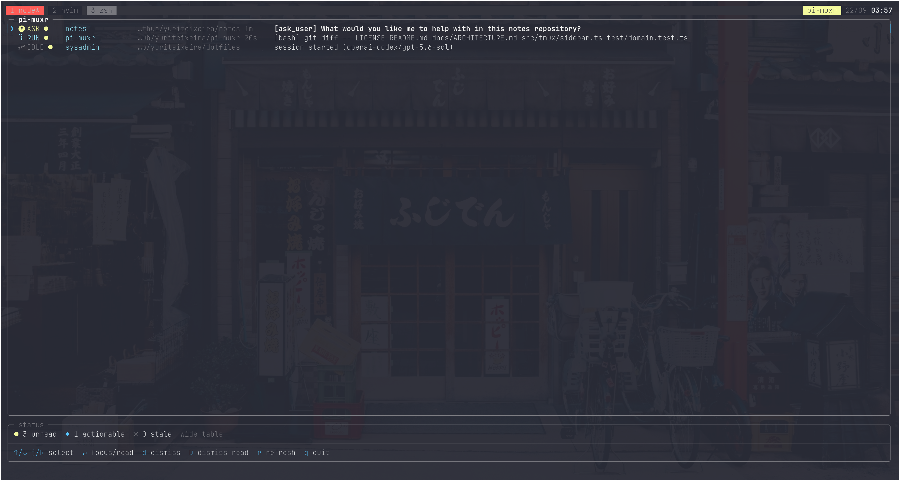

# Welcome to `pi-muxr`!

If you use [Pi](https://pi.dev) and if you sorta like `herdr`, but if you're a die-hard tmux user that want your tooling to 
adapt to your workflow and not the other way around, you came to the right place.

`pi-muxr` is a dashboard for Pi coding sessions that run in tmux.





## Features

- Tracks multiple Pi sessions across tmux.
- Shows `ASK`, `ERROR`, `DONE`, `RUN`, `IDLE`, and `STALE` states.
- Sorts actionable sessions first.
- Focuses the owning tmux pane from the keyboard.
- Supports read and dismiss actions.
- Detects stale sessions with heartbeats and pane checks.
- Provides terminal and browser interfaces.
- Provides a toggleable pinned sidebar across all tmux sessions and windows.
- Sends terminal bell, desktop, and browser notifications.
- Supports configurable actionable states and notification behavior.

## Installation

Requirements:

- [Node.js 24 or later](https://nodejs.org/en/download)
- [Tmux](https://github.com/tmux/tmux?tab=readme-ov-file)
- [Pi](https://pi.dev)

Install the extension and its command with Pi:

```bash
pi install npm:@yuriteixeira/pi-muxr
```

Restart Pi after installation, or run `/reload` in an active session.

To install only the dashboard command globally:

```bash
npm install --global @yuriteixeira/pi-muxr
```

## Usage

```bash
# Open the dashboard in the current pane
pi-muxr

# Toggle the pinned dashboard sidebar
pi-muxr --sidebar
pi-muxr --sidebar right
pi-muxr --sidebar left

# Exit after selecting a session, useful in a tmux popup
pi-muxr --quit-on-select

# Output Pi sessions to standard output
pi-muxr --list

# Start the web app with a terminal emulator
# so you can continue your work from another device
pi-muxr --web
```

Run `pi-muxr --sidebar` inside tmux to open and pin a full height dashboard pane on the right side of every window in every tmux session. Pass `left` or `right` to select the side. Each pane uses at most 25 percent of the window width. New tmux sessions and windows receive the same sidebar while it is pinned. The pinned sidebar is toggleable. Run the same command again to close all dashboard sidebar panes and remove the pin.

Use `--quit-on-select` to close the interactive dashboard after Enter focuses the selected row. The browser interface runs at `http://127.0.0.1:3042` by default.

### Tmux shortcuts

Add bindings like these to `~/.tmux.conf`:

```tmux
# Press the tmux prefix, then m, to open pi-muxr in a popup.
bind-key m display-popup -E -w 90% -h 90% "pi-muxr --quit-on-select"

# Press the tmux prefix, then s, to toggle the pinned right sidebar.
bind-key s run-shell "pi-muxr --sidebar right"
```

The default tmux prefix is `Ctrl+b`. With these bindings, press `Ctrl+b`, then `m` for the popup, or press `Ctrl+b`, then `s` for the sidebar. Change `right` to `left` if you want the sidebar on the left.

Reload the tmux configuration after you save it:

```bash
tmux source-file ~/.tmux.conf
```

The popup closes after you select a session because it uses `--quit-on-select`. The sidebar stays pinned across existing and new tmux sessions and windows. Use the same sidebar shortcut again to close it and remove the pin.

## Configuration

Configuration is optional. When `~/.pi-muxr/config.json` does not exist, pi-muxr uses its built in defaults.

The repository provides [an example configuration](examples/config.json) with every available setting. From a repository checkout, copy it to the configuration path:

```bash
mkdir -p ~/.pi-muxr
cp examples/config.json ~/.pi-muxr/config.json
```

You can then edit the copied file. The settings control:

- The state directory and SQLite database path.
- Which session states need action.
- Desktop notifications and the dashboard bell.
- Whether the dashboard shows dismissed rows.
- Stale session, heartbeat, and dashboard presence timing.

To check the active configuration, including defaults and your changes, run:

```bash
pi-muxr --config
```

## Development Documentation

- [Architecture](docs/ARCHITECTURE.md)
- [Building and local setup](docs/BUILDING.md)
- [Contributing](docs/CONTRIBUTING.md)
